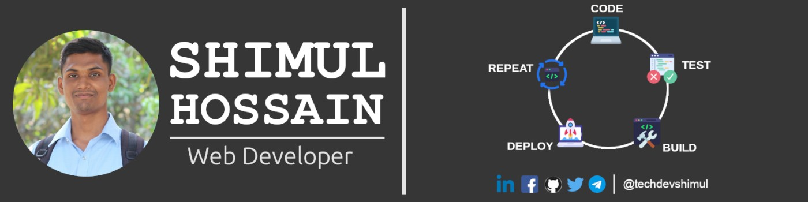

# Hi there 👋

I am **Shimul Hossain**, I am a web developer with a passion for building beautiful, responsive websites and applications. I'm a Experienced Full Stack Web developer in software industry. Excellent reputation for resolving problems and improving customer satisfaction. I'm a Full Stack Web developer to help you to build your personal website with seamless customization.

_💼 Experience:_

- 1+ years of professional experience in Frontend Development & Backend Deployment
- Strong expertise in JavaScript, React.js, Next.js, Zustand, Node.js, Express.js, Expo, React Native, Deployments and Socket.io
- Skilled in Website Optimization, SEO for better ranking and visibility

_🛠️ Skills:_

- Proficient in JavaScript and modern frontend frameworks such as React, Next.js, and Zustand.
- Experienced in backend development with Node.js and deployment with Express.
- SEO: Building websites with structured schema, performance tuning, and search visibility strategies

Want to know more about me ? [**Check out my Portfolio.**](https://techdevshimul.vercel.app/)

_🌱 What I’m Learning:_
Currently diving deeper into the MERN Stack to expand my full-stack capabilities and mastering AI-driven SEO optimization to build future-ready applications.

What I’m Working On

- Building high-performance, SEO-optimized personal websites
- Exploring Generative AI for modern web projects

⚡ Fun Fact
I believe creativity with code can solve real-world problems and sometimes, I think I’m a little crazy about it.

## 👨‍💻 Skills & Experience:

         
 
 

<table border="0">
  <tr>
    <td>
    
&nbsp;

  </td>

  <td>
  
  </td>
  </tr>
</table>

 
Connect with me:
 
 

 
 

## 📧 For Business Inquiries:

 

